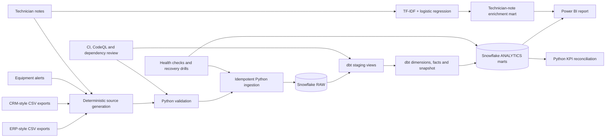
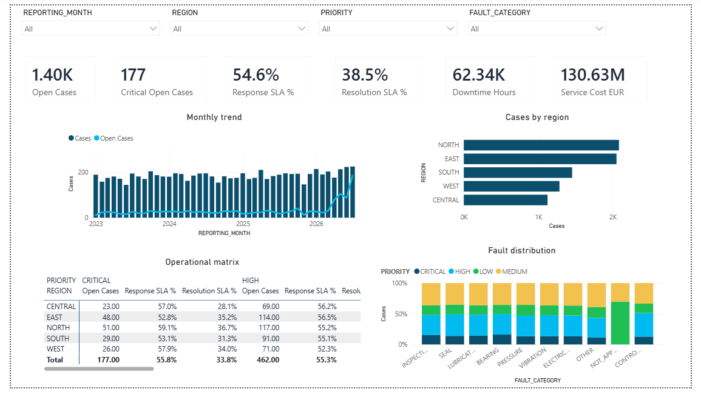
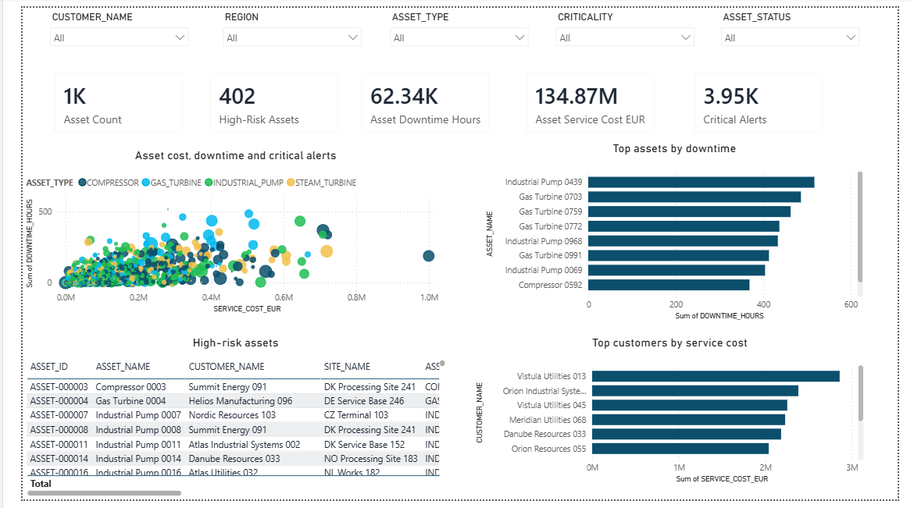

# Industrial Service Data & AI Platform

[](https://github.com/sakthi-kr/industrial-service-data-platform/actions/workflows/ci.yml)
[](https://github.com/sakthi-kr/industrial-service-data-platform/actions/workflows/codeql.yml)
[](https://www.python.org/)
[](LICENSE)

A reproducible data platform for industrial equipment service operations. It connects synthetic ERP, CRM, equipment-monitoring, and technician-note data to Snowflake, dbt, Power BI, and a small evaluated machine-learning enrichment workflow.

The project is designed as a portfolio-scale implementation rather than a mock enterprise product. The emphasis is on evidence: deterministic source data, explicit business rules, tested transformations, independently reconciled KPIs, access controls, operational checks, and documented limitations.

## What this project demonstrates

- deterministic generation of 13 related industrial-service datasets containing 107,724 records;
- schema validation, rejected-record handling, audit logging, and duplicate-safe Snowflake ingestion;
- role-based Snowflake infrastructure with cost controls and managed-access schemas;
- dbt staging, dimensional, fact, snapshot, and analytics models with extensive data tests;
- independent Python-versus-Snowflake reconciliation of 12 operational KPIs;
- a two-page Power BI report with filter-safe DAX measures and reviewable PDF/screenshots;
- evaluated TF-IDF and logistic-regression enrichment for 5,000 technician notes;
- health checks, recovery drills, CI, CodeQL, dependency review, and incident runbooks.

## Architecture



A more detailed component and trust-boundary description is available in [`docs/architecture.md`](docs/architecture.md).

## Evidence at a glance

| Area | Evidence |
|---|---|
| Source data | 13 deterministic datasets, 107,724 records, fixed seed and file hashes |
| Ingestion | 13 raw tables, audit records, zero duplicate inserts on rerun |
| Analytics | 12 KPIs independently reconciled between Python and Snowflake |
| Reporting | Two Power BI pages, 18 DAX measures, PDF and sanitized screenshots |
| Machine learning | 5,000 predictions, grouped holdout split, macro-F1 reporting, masked-label challenge |
| Operations | Live platform health checks, six recovery drills, rollback test, cost review |
| Quality | Python 3.10–3.12 CI, Ruff, mypy, pytest, dbt tests, CodeQL and dependency review |

## Dashboard

| Service operations | Asset and customer analysis |
|---|---|
|  |  |

The reviewable PDF export is available at [`dashboards/power_bi/exports/industrial_service_dashboard.pdf`](dashboards/power_bi/exports/industrial_service_dashboard.pdf). The Power BI working file is distributed with the GitHub release rather than committed as an opaque binary.

## Repository structure

```text
config/                         Project, generation, reconciliation and health configuration
dashboards/power_bi/             Theme, DAX, report specification, screenshots and PDF export
data/samples/                   Small public samples and sanitized verification summaries
dbt/                            Sources, staging views, core models, snapshots, marts and tests
docs/                           Architecture, data model, verification records and runbooks
scripts/                        Reproducible entry points and repository validators
sql/                            Snowflake setup, verification, analytics and operational SQL
src/industrial_service_platform Python package for generation, ingestion, ML and operations
tests/                          Automated tests
```

## Reproduce the workflow

### Local environment

```bash
py -3.10 -m venv .venv
source .venv/Scripts/activate
python -m pip install --upgrade pip setuptools wheel
python -m pip install -e ".[dev]"
```

Copy `.env.example` to `.env` and add private Snowflake connection values. Copy `dbt/profiles.example.yml` to `dbt/profiles.yml`. Both local files are ignored by Git.

### Generate and validate source data

```bash
python -m industrial_service_platform generate-data
python -m industrial_service_platform validate-data
python -m industrial_service_platform prepare-ingestion
```

### Load Snowflake and build analytics models

```bash
python -m industrial_service_platform test-snowflake
python -m industrial_service_platform create-raw-tables
python -m industrial_service_platform ingest
python scripts/run_dbt.py build --fail-fast
```

### Reconcile metrics and evaluate enrichment

```bash
python scripts/reconcile_analytics.py
python scripts/train_note_enrichment.py
python scripts/publish_note_enrichment.py
python scripts/run_dbt.py build --select +mart_technician_note_enrichment --fail-fast
```

### Check operational health

```bash
python scripts/run_recovery_drills.py
python scripts/check_platform_health.py
```

The full run order, expected outputs, external software steps, and verification gates are documented in [`docs/reproducibility.md`](docs/reproducibility.md).

## Design decisions

**Source-preserving raw layer.** Raw Snowflake tables keep source values as text and add ingestion metadata. Typing and business-rule enforcement happen in dbt staging models, making source problems visible instead of silently coercing them.

**Duplicate-safe loading.** Each complete source row receives a deterministic SHA-256 record hash. Reprocessing the same files creates a new audit run without duplicating business records.

**Independent KPI validation.** The Python reference implementation reads generated CSV files rather than reusing warehouse SQL. Counts must match exactly; rates, durations, and currency use explicit tolerances.

**Small, explainable enrichment model.** Technician-note enrichment uses sparse text features and logistic regression instead of an external language-model API. A service-order-grouped split prevents related notes from crossing train and test sets, and a masked-label challenge exposes dependence on direct fault phrases.

**Least privilege and bounded cost.** Loader, transformer, analyst, and administrator roles have separate responsibilities. The warehouse is X-Small, auto-suspends after 60 seconds, and is attached to a resource monitor.

## Limitations

- All business data is synthetic; no claim is made about production performance on real service records.
- The generated notes contain strong lexical signals, so the normal holdout score is not evidence of broad language understanding. The masked-label challenge documents this limitation.
- SLA calculations use elapsed hours rather than customer-specific working calendars and holiday rules.
- The Power BI report is validated against a small imported dataset; deployment and scheduled refresh in the Power BI Service are outside scope.
- Operational health checks are command-driven rather than a continuously hosted monitoring service.

## Documentation

Start with:

- [`docs/architecture.md`](docs/architecture.md) — components, data flow and trust boundaries;
- [`docs/reproducibility.md`](docs/reproducibility.md) — complete run order and verification gates;
- [`docs/portfolio_summary.md`](docs/portfolio_summary.md) — concise project outcomes and interview discussion points;
- [`docs/data_dictionary.md`](docs/data_dictionary.md) and [`docs/kpi_catalogue.md`](docs/kpi_catalogue.md) — source fields and metric definitions;
- [`docs/operations_runbook.md`](docs/operations_runbook.md) and [`docs/recovery_procedures.md`](docs/recovery_procedures.md) — health and recovery procedures.

## Security and data handling

The repository excludes credentials, Snowflake keys, local dbt profiles, generated full datasets, private screenshots, and the Power BI working file. Security reporting and supported-version information are in [`SECURITY.md`](SECURITY.md).

## Release

The first complete portfolio release is `v1.0.0`. Release notes are in [`docs/release_notes_v1.0.0.md`](docs/release_notes_v1.0.0.md), and changes are recorded in [`CHANGELOG.md`](CHANGELOG.md).

## Licence

Released under the [MIT License](LICENSE).
