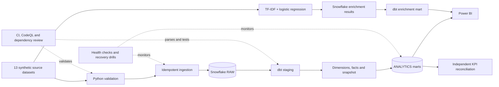

# Industrial Service Data & AI Platform

[](https://github.com/sakthi-kr/industrial-service-data-platform/actions/workflows/ci.yml)
[](https://github.com/sakthi-kr/industrial-service-data-platform/actions/workflows/codeql.yml)
[](https://www.python.org/)
[](LICENSE)

A reproducible analytics platform for industrial equipment service operations. It connects synthetic ERP, CRM, equipment-monitoring and technician-note data to Snowflake, dbt, Power BI and an evaluated machine-learning enrichment workflow.

This is a portfolio-scale implementation, not a mock enterprise product. The emphasis is on verifiable engineering evidence: deterministic data, explicit business rules, tested transformations, independently reconciled KPIs, least-privilege access, operational checks and documented limitations.

## What the project demonstrates

- deterministic generation of 13 linked datasets containing 107,724 records;
- schema validation, rejected-record handling, audit logging and duplicate-safe Snowflake ingestion;
- managed-access Snowflake schemas, functional roles and bounded warehouse cost;
- dbt staging, dimensional, fact, snapshot and analytics models with extensive tests;
- independent Python-versus-Snowflake reconciliation of 12 operational KPIs;
- a two-page Power BI report with 18 filter-safe DAX measures;
- evaluated TF-IDF and logistic-regression enrichment for 5,000 technician notes;
- platform health checks, recovery drills, CI, CodeQL and dependency review.

## Architecture



See [`docs/architecture.md`](docs/architecture.md) for component responsibilities, trust boundaries and failure handling.

## Evidence at a glance

| Area | Evidence |
|---|---|
| Source data | 13 deterministic datasets, 107,724 records, fixed seed and file hashes |
| Ingestion | 13 raw tables, audit records and zero duplicate inserts on rerun |
| Analytics | 12 KPIs independently reconciled between Python and Snowflake |
| Reporting | Two Power BI pages, 18 DAX measures, PDF export and sanitized screenshots |
| Machine learning | 5,000 predictions, grouped holdout split, macro-F1 reporting and masked-label challenge |
| Operations | Live health checks, six recovery drills, rollback test and cost review |
| Quality | Python 3.10–3.12 CI, Ruff, mypy, pytest, dbt tests, CodeQL and dependency review |

## Dashboard

| Service operations | Asset and customer analysis |
|---|---|
|  |  |

The reviewable report is available as a [two-page PDF](dashboards/power_bi/exports/industrial_service_dashboard.pdf). The editable `.pbix` file remains local and is intentionally excluded from Git because it is an opaque binary.

## Repository structure

```text
config/                          Project, generation, reconciliation and health configuration
dashboards/power_bi/             Theme, DAX, report specification, screenshots and PDF export
data/samples/                    Small public samples and sanitized verification summaries
dbt/                             Sources, staging views, core models, snapshots, marts and tests
docs/                            Architecture, data model, verification records and runbooks
scripts/                         Reproducible entry points and repository validators
sql/                             Snowflake setup, verification, analytics and operational SQL
src/industrial_service_platform/ Python package for generation, ingestion, enrichment and operations
tests/                           Automated tests
```

## Reproduce the workflow

### Local environment

```bash
py -3.10 -m venv .venv
source .venv/Scripts/activate
python -m pip install --upgrade pip setuptools wheel
python -m pip install -e ".[dev]"
```

Copy `.env.example` to `.env` and `dbt/profiles.example.yml` to `dbt/profiles.yml`. Both local files are ignored by Git.

### Generate, validate and ingest

```bash
python -m industrial_service_platform generate-data
python -m industrial_service_platform validate-data
python -m industrial_service_platform prepare-ingestion
python -m industrial_service_platform test-snowflake
python -m industrial_service_platform create-raw-tables
python -m industrial_service_platform ingest
```

### Build analytics and enrichment

```bash
python scripts/run_dbt.py build --fail-fast
python scripts/reconcile_analytics.py
python scripts/train_note_enrichment.py
python scripts/publish_note_enrichment.py
python scripts/run_dbt.py build --select +mart_technician_note_enrichment --fail-fast
```

### Run operational checks

```bash
python scripts/run_recovery_drills.py
python scripts/check_platform_health.py
```

The complete run order, expected outputs and verification gates are documented in [`docs/reproducibility.md`](docs/reproducibility.md).

## Key design decisions

**Source-preserving raw layer.** Snowflake raw tables retain source values as text and add ingestion metadata. dbt staging performs explicit type conversion and business-rule checks.

**Duplicate-safe loading.** Each complete source row receives a deterministic SHA-256 hash. Reprocessing the same files creates a new audit run without duplicating business records.

**Independent KPI validation.** The Python reference implementation reads generated CSV files rather than reusing warehouse SQL. Counts must match exactly; rates, durations and currency use explicit tolerances.

**Explainable enrichment.** Technician-note enrichment uses sparse text features and logistic regression. A service-order-grouped split prevents related notes from crossing train and test sets, while a masked-label challenge exposes dependence on direct fault phrases.

**Least privilege and bounded cost.** Loader, transformer, analyst and administrator roles have separate responsibilities. The X-Small warehouse auto-suspends after 60 seconds and is attached to a resource monitor.

## Limitations

- All business data is synthetic; the results do not claim production performance on real service records.
- Generated notes contain strong lexical signals, so the normal holdout score is not evidence of broad language understanding.
- SLA calculations use elapsed hours rather than customer-specific working calendars and holiday rules.
- Power BI Service deployment and scheduled refresh are outside scope.
- Operational health checks are command-driven rather than continuously hosted.

## Documentation

- [`docs/architecture.md`](docs/architecture.md) — components, data flow and trust boundaries;
- [`docs/reproducibility.md`](docs/reproducibility.md) — complete run order and verification gates;
- [`docs/portfolio_summary.md`](docs/portfolio_summary.md) — project outcomes and interview discussion points;
- [`docs/data_dictionary.md`](docs/data_dictionary.md) and [`docs/kpi_catalogue.md`](docs/kpi_catalogue.md) — fields and metric definitions;
- [`docs/operations_runbook.md`](docs/operations_runbook.md) and [`docs/recovery_procedures.md`](docs/recovery_procedures.md) — health and recovery procedures.

## Version, security and licence

The annotated tag `v1.0.0` identifies the first audited portfolio version. Version notes are in [`docs/release_notes_v1.0.0.md`](docs/release_notes_v1.0.0.md), and subsequent changes are recorded in [`CHANGELOG.md`](CHANGELOG.md). No GitHub Release is published, so the `.pbix` file is not publicly distributed.

Credentials, local dbt profiles, generated full datasets, private screenshots and the Power BI working file are excluded from version control. See [`SECURITY.md`](SECURITY.md) for vulnerability reporting and supported-version information.

Released under the [MIT License](LICENSE).
