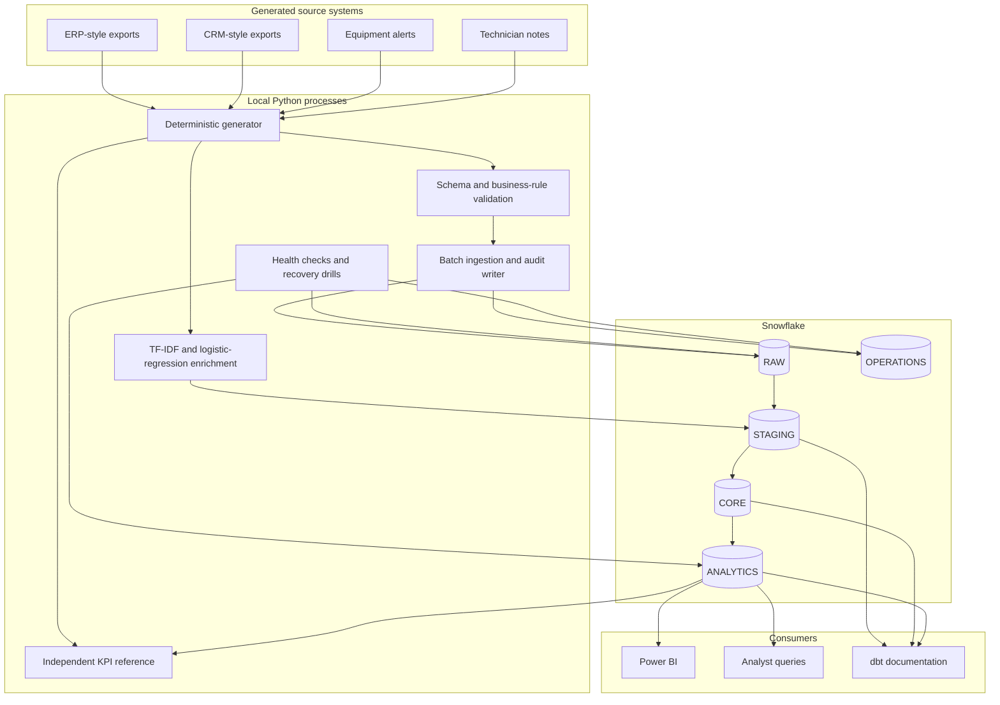

# Architecture

## Purpose

The platform models the path from operational service records to tested analytics and a small machine-learning enrichment. It separates source preservation, transformation, reporting and operational control so that each layer can be checked independently.

## Component view

## Layer responsibilities

| Layer | Responsibility | Main controls |
|---|---|---|
| Generated files | Reproducible source exports and deliberate invalid examples | fixed seed, hashes, schema catalogue |
| `RAW` | Preserve accepted source values and ingestion metadata | record hashes, batch IDs, source row numbers |
| `STAGING` | Type conversion, cleaning, source deduplication and published enrichment results | dbt tests, accepted values, timestamp rules |
| `CORE` | Reusable dimensions, facts and asset history | surrogate keys, relationships, snapshots |
| `ANALYTICS` | KPI-ready marts and enrichment output | metric tests, Python reconciliation, analyst access |
| `OPERATIONS` | Pipeline history, rejected rows and quality results | health checks, runbooks, recovery drills |

## Trust boundaries

### Local credentials

Snowflake connection values exist only in `.env` and `dbt/profiles.yml`. Both files are ignored. Application commands select a functional role rather than using `ACCOUNTADMIN`.

### Snowflake roles

- `ISP_LOADER` writes source-preserving records to `RAW` and ingestion audit tables.
- `ISP_TRANSFORMER` reads `RAW` and writes dbt and enrichment objects.
- `ISP_ANALYST` reads analytics marts only.
- `ISP_ADMIN` runs operational health queries across the project database.

Account-level SQL is limited to explicit infrastructure, resource-monitor and historical-usage checks.

### Public evidence

Only sanitized samples, evaluation summaries, dashboard screenshots and a PDF report are tracked. Generated full datasets, private evidence screenshots, model artifacts and the `.pbix` working file remain outside Git.

## Failure handling

- invalid source rows are separated before loading and written to rejected-record audit storage;
- dataset loads use transactions and rollback on failure;
- deterministic hashes make reruns duplicate-safe;
- dbt tests block invalid transformations;
- reconciliation blocks mismatched KPIs;
- enrichment output validation blocks malformed predictions;
- health checks detect stale runs, row-count drift, rejection spikes and warehouse misconfiguration.

## Cost controls

The project uses an X-Small warehouse with 60-second auto-suspend and auto-resume. A monthly resource monitor bounds warehouse credit use. Historical usage and failed queries are reviewed through Snowflake Account Usage views.
